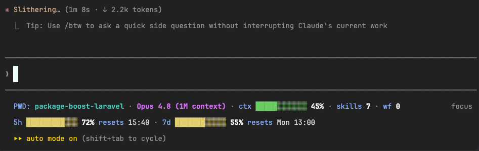

# claude-statusline

[](LICENSE)
[](statusline.sh)
[](https://docs.claude.com/en/docs/claude-code/statusline)

A two-row, color-coded status line for [Claude Code](https://docs.claude.com/en/docs/claude-code). It shows your working directory, model, context-window usage, how many skills and workflows you've used this session, and your 5-hour / 7-day rate-limit windows with progress bars and reset times.



```
PWD: app · Claude Opus 4.8 · ctx ███░░░░░░░░░ 24% · skills 3 · wf 1
5h ████░░░░░░░░ 31% resets 14:30 · 7d ██░░░░░░░░░░ 12% resets Tue 09:00
```

In the terminal the directory is cyan, the model magenta, labels light-blue, values bright white, and each bar is green / yellow / red by how full it is.

## Install

```bash
curl -fsSL https://raw.githubusercontent.com/sandermuller/claude-statusline/main/install.sh | bash
```

The installer drops `statusline.sh` into your Claude Code config directory and merges the `statusLine` key into `settings.json`. It backs up `settings.json` first and leaves the rest of your settings alone. Start a new interaction in Claude Code and the status line appears.

Prefer not to pipe to a shell? See [manual install](#manual-install).

## What it shows

| Segment                      | Source                           | Notes                                           |
|------------------------------|----------------------------------|-------------------------------------------------|
| `PWD: <dir>`                 | `workspace.current_dir`          | Shortened — see [configuration](#configuration) |
| model                        | `model.display_name`             |                                                 |
| `ctx <bar> NN%`              | `context_window.used_percentage` | Bar colored by usage                            |
| `skills N`                   | session transcript               | Count of `Skill` tool calls this session        |
| `wf N`                       | session transcript               | Count of `Workflow` tool calls this session     |
| `5h <bar> NN% resets <time>` | `rate_limits.five_hour.*`        | 5-hour rate-limit window                        |
| `7d <bar> NN% resets <time>` | `rate_limits.seven_day.*`        | 7-day rate-limit window                         |

Bar colors: green below 50%, yellow 50–79%, red 80%+.

### The `PWD` segment

The directory is shortened so you see *where you are* without the noise of a full path. It depends on `CLAUDE_STATUSLINE_PROJECT_ROOT` (default `$HOME/Documents/GitHub`):

| Current directory                                      | Shown as                              | Why                                                   |
|--------------------------------------------------------|---------------------------------------|-------------------------------------------------------|
| `~/Documents/GitHub/claude-statusline`                 | `claude-statusline`                   | Repo at the root of `PROJECT_ROOT` — just its name    |
| `~/Documents/GitHub/claude-statusline/internal/blabla` | `claude-statusline → internal/blabla` | In a subfolder — repo name, arrow, then the subpath   |
| `~/Documents/GitHub`                                   | `~/Documents/GitHub`                  | `PROJECT_ROOT` itself — not inside a repo             |
| `~/Downloads/foo`                                      | `~/Downloads/foo`                     | Outside `PROJECT_ROOT` — full path, `$HOME` collapsed |
| `/etc/nginx`                                           | `/etc/nginx`                          | Outside `$HOME` — shown verbatim                      |
| `~`                                                    | `~`                                   | Home directory                                        |

The `repo → sub/path` form makes it obvious you're in the `claude-statusline` repo *and* which subfolder, instead of either the bare folder name or the whole absolute path.

Set `CLAUDE_STATUSLINE_PROJECT_ROOT=""` to disable the repo shortening — then paths only get `$HOME` collapsed to `~`.

## Requirements

- Claude Code (recent enough to expose the `rate_limits.*` and `context_window.*` fields on the status-line input).
- [`jq`](https://jqlang.github.io/jq/) — `brew install jq` on macOS, `sudo apt install jq` on Debian/Ubuntu.
- A terminal with 256-color ANSI support (iTerm2, Kitty, WezTerm, modern Terminal.app, most Linux terminals).
- The 5h/7d row only appears on subscription plans that report rate limits. On API-key billing those fields are absent and that row is simply omitted.

## Configuration

Two knobs, set as environment variables (or edit the top of `statusline.sh`):

| Variable                         | Default                  | Effect                                                                                                                            |
|----------------------------------|--------------------------|-----------------------------------------------------------------------------------------------------------------------------------|
| `CLAUDE_STATUSLINE_PROJECT_ROOT` | `$HOME/Documents/GitHub` | Paths under this folder are shown relative to it (`~/Documents/GitHub/app` → `app`). Set to `""` to just collapse `$HOME` to `~`. |
| `CLAUDE_STATUSLINE_BAR_WIDTH`    | `12`                     | Width of each progress bar in characters.                                                                                         |

To change them, set the variable wherever Claude Code picks up your environment, or edit the `PROJECT_ROOT` / `BAR_WIDTH` lines at the top of the installed `statusline.sh`. The color palette and the green/yellow/red thresholds are defined just below those lines and are easy to tweak.

## How it works

Claude Code pipes a JSON object describing the session to your status-line command on stdin, and renders whatever the command prints. This script reads that JSON with `jq`, builds two lines, and prints them. The only thing it reads from outside the JSON is the session transcript file (path provided in the JSON), which it greps to count skills and workflows. There are no network calls and no other dependencies.

See the [Claude Code status line docs](https://docs.claude.com/en/docs/claude-code/statusline) for the full input schema.

## Manual install

1. Save [`statusline.sh`](statusline.sh) to `~/.claude/statusline.sh` and make it executable:
   ```bash
   chmod +x ~/.claude/statusline.sh
   ```
2. Add this to `~/.claude/settings.json` (merge it with any existing settings):
   ```json
   {
     "statusLine": {
       "type": "command",
       "command": "bash ~/.claude/statusline.sh"
     }
   }
   ```

## Troubleshooting

- **No colors / raw escape codes shown** — your terminal isn't interpreting ANSI. Use a 256-color terminal.
- **`jq: command not found`** — install `jq` (see requirements).
- **The 5h/7d row is missing** — your plan or Claude Code version doesn't report rate limits; everything else still works.
- **`skills`/`wf` always 0** — the transcript path wasn't available; counts resume once the session has a transcript on disk.
- **Custom config directory** — the installer honors `CLAUDE_CONFIG_DIR` if you've set it.

## Uninstall

```bash
curl -fsSL https://raw.githubusercontent.com/sandermuller/claude-statusline/main/uninstall.sh | bash
```

Removes the `statusLine` key (backing up `settings.json`) and deletes the installed script.

## License

[MIT](LICENSE)
