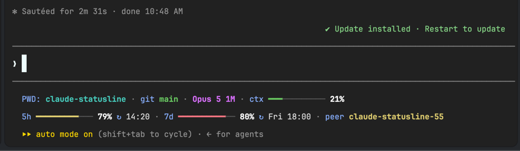

# claude-statusline

[](LICENSE)
[](statusline.sh)
[](https://docs.claude.com/en/docs/claude-code/statusline)

A responsive, color-coded status line for [Claude Code](https://docs.claude.com/en/docs/claude-code). It shows your working directory, git branch, model, context-window usage, your 5-hour / 7-day rate-limit windows with progress bars and reset times, and the session name other Claude Code sessions use to message this one.

Segments are packed into as many rows as your terminal needs, with a fixed break between the working-context group and the rate-limit group so the two never share a row.



```
PWD: app · git main · Claude Opus 4.8 · ctx ━━━───────── 24%
5h ━━━━──────── 31% ↻ 14:30 · 7d ━━────────── 12% ↻ Tue 09:00 · peer app-55
```

In the terminal the directory is cyan, the branch green, the model magenta, the session name yellow, labels light-blue, values bright white, and each bar is green / yellow / red by how full it is.

## Install

```bash
curl -fsSL https://raw.githubusercontent.com/sandermuller/claude-statusline/main/install.sh | bash
```

The installer drops `statusline.sh` into your Claude Code config directory and merges the `statusLine` key into `settings.json`. It backs up `settings.json` first and leaves the rest of your settings alone. Start a new interaction in Claude Code and the status line appears.

Prefer not to pipe to a shell? See [manual install](#manual-install).

## What it shows

| Segment                 | Source                           | Notes                                                                       |
|-------------------------|----------------------------------|-----------------------------------------------------------------------------|
| `PWD: <dir>`            | `workspace.current_dir`          | Shortened — see [the `PWD` segment](#the-pwd-segment)                       |
| `git <branch>`          | `git symbolic-ref HEAD`          | Short SHA when detached; omitted outside a repo                             |
| model                   | `model.display_name`             | `Opus 5 (1M context)` is compacted to `Opus 5 1M`                           |
| `ctx <bar> NN%`         | `context_window.used_percentage` | Bar colored by usage                                                        |
| `5h <bar> NN% ↻ <time>` | `rate_limits.five_hour.*`        | 5-hour rate-limit window; `↻` marks the reset time                          |
| `7d <bar> NN% ↻ <time>` | `rate_limits.seven_day.*`        | 7-day rate-limit window                                                     |
| `peer <name>`           | `~/.claude/sessions/*.json`      | The name other sessions use to message this one, matched on `session_id`    |

Bar colors: green below 50%, yellow 50–79%, red 80%+. Bars are drawn as rules — a heavy line in the usage color over a light grey track — to keep their visual weight down.

### The `PWD` segment

The directory is shortened so you see *where you are* without the noise of a full path. It depends on `CLAUDE_STATUSLINE_PROJECT_ROOT` (default `$HOME/Documents/GitHub`):

| Current directory                                      | Shown as                              | Why                                                   |
|--------------------------------------------------------|---------------------------------------|-------------------------------------------------------|
| `~/Documents/GitHub/claude-statusline`                 | `claude-statusline`                   | Repo at the root of `PROJECT_ROOT` — just its name    |
| `~/Documents/GitHub/claude-statusline/internal/blabla` | `claude-statusline → internal/blabla` | In a subfolder — repo name, arrow, then the subpath   |
| `~/Documents/GitHub`                                   | `~/Documents/GitHub`                  | `PROJECT_ROOT` itself — not inside a repo             |
| `~/Downloads/foo`                                      | `~/Downloads/foo`                     | Outside `PROJECT_ROOT` — full path, `$HOME` collapsed |
| `/etc/nginx`                                           | `/etc/nginx`                          | Outside `$HOME` — shown verbatim                      |
| `~`                                                    | `~`                                   | Home directory                                        |

The `repo → sub/path` form makes it obvious you're in the `claude-statusline` repo *and* which subfolder, instead of either the bare folder name or the whole absolute path.

Set `CLAUDE_STATUSLINE_PROJECT_ROOT=""` to disable the repo shortening — then paths only get `$HOME` collapsed to `~`.

## Requirements

- Claude Code (recent enough to expose the `rate_limits.*` and `context_window.*` fields on the status-line input).
- [`jq`](https://jqlang.github.io/jq/) — `brew install jq` on macOS, `sudo apt install jq` on Debian/Ubuntu.
- A terminal with 256-color ANSI support (iTerm2, Kitty, WezTerm, modern Terminal.app, most Linux terminals).
- The 5h/7d row only appears on subscription plans that report rate limits. On API-key billing those fields are absent and that row is simply omitted.

## Configuration

Set these as environment variables, or edit the block at the top of `statusline.sh`:

| Variable                         | Default                  | Effect                                                                                                                                                      |
|----------------------------------|--------------------------|-------------------------------------------------------------------------------------------------------------------------------------------------------------|
| `CLAUDE_STATUSLINE_PROJECT_ROOT` | `$HOME/Documents/GitHub` | Paths under this folder are shown relative to it (`~/Documents/GitHub/app` → `app`). Set to `""` to just collapse `$HOME` to `~`.                           |
| `CLAUDE_STATUSLINE_BAR_WIDTH`    | `12`                     | Width of each progress bar in columns.                                                                                                                      |
| `CLAUDE_CONFIG_DIR`              | `$HOME/.claude`          | Where the session registry (`sessions/`) is read from for the `peer` name.                                                                                   |
| `CLAUDE_STATUSLINE_WIDTH`        | `$COLUMNS`, else `80`    | Width to lay out against. Claude Code exports `COLUMNS`, so this is rarely worth setting.                                                                    |
| `CLAUDE_STATUSLINE_GUTTER`       | `4`                      | Columns held back from `$COLUMNS`. Claude Code renders the status line in a padded container, so the usable width is narrower — measured at 4.               |
| `CLAUDE_STATUSLINE_MAX_ROWS`     | `0` (no cap)             | Row ceiling. Set a number and rows past it may overflow and be clipped rather than growing a taller block. The default never clips.                          |
| `CLAUDE_STATUSLINE_DIR_MAX`      | `0` (no ceiling)         | Optional hard ceiling for the directory.                                                                                                                    |
| `CLAUDE_STATUSLINE_BRANCH_MAX`   | `0` (no ceiling)         | Optional hard ceiling for the branch, cut from the tail.                                                                                                    |
| `CLAUDE_STATUSLINE_PEER_MAX`     | `0` (no ceiling)         | Optional hard ceiling for the session name, cut from the **front** (`…-src-8d`) — the suffix is what tells two sessions apart.                               |

The color palette and the green/yellow/red thresholds are defined just below that block and are easy to tweak.

## How it works

Claude Code pipes a JSON object describing the session to your status-line command on stdin, and renders whatever the command prints — including multiple lines. This script reads that JSON with `jq`, builds a list of segments, and packs them into rows that fit the terminal.

Long values are not shortened while there is room for them. Packing already moves a segment to its own row when it does not fit beside its neighbours, so a field is elided only when its whole segment would overflow a row by itself. In `repo → sub/path` the repo name is the anchor and the subpath gives way first, from its head.

Row 1 is where you are and what you are using — directory, branch, model, context. Row 2 onward is your budget — the rate-limit windows and the session name. The rate-limit group is marked "starts a new row", so a wide terminal never pulls `5h` up next to `ctx` and the layout does not rearrange itself every time you resize.

Each segment is recorded with its display width as it is built, so the wrapper never has to parse escape codes back out of a rendered string. Packing runs twice: once greedily against the full width, which gives the fewest rows possible, and once against an even share of that row count so the rows come out balanced. The second pass is kept only if it did not cost an extra row.

Width comes from `$COLUMNS`, which Claude Code exports to the status-line process. There is no controlling terminal (`/dev/tty` is not available), so `stty` and `tput` cannot be used. `$COLUMNS` is the terminal width, not the render width: the status line sits in a padded container about 4 columns narrower, which `CLAUDE_STATUSLINE_GUTTER` accounts for.

Outside the JSON it reads two things: `git symbolic-ref` in the working directory for the branch, and Claude Code's session registry under `~/.claude/sessions`, matched on `session_id`, for the peer session name. There are no network calls and no other dependencies.

See the [Claude Code status line docs](https://docs.claude.com/en/docs/claude-code/statusline) for the full input schema.

## Manual install

1. Save [`statusline.sh`](statusline.sh) to `~/.claude/statusline.sh` and make it executable:
   ```bash
   chmod +x ~/.claude/statusline.sh
   ```
2. Add this to `~/.claude/settings.json` (merge it with any existing settings):
   ```json
   {
     "statusLine": {
       "type": "command",
       "command": "bash ~/.claude/statusline.sh"
     }
   }
   ```

## Troubleshooting

- **No colors / raw escape codes shown** — your terminal isn't interpreting ANSI. Use a 256-color terminal.
- **`jq: command not found`** — install `jq` (see requirements).
- **The 5h/7d row is missing** — your plan or Claude Code version doesn't report rate limits; everything else still works.
- **No `git` segment** — the working directory isn't inside a git repository.
- **No `peer` segment** — your Claude Code version doesn't keep a session registry under `~/.claude/sessions`, or `CLAUDE_CONFIG_DIR` points elsewhere.
- **More rows than you want** — shorten the content: `CLAUDE_STATUSLINE_BAR_WIDTH=8` is the biggest lever, or set the `*_MAX` ceilings.
- **A row is clipped with `…`** — raise `CLAUDE_STATUSLINE_GUTTER`; your terminal reserves more padding than the measured 4.
- **Custom config directory** — the installer honors `CLAUDE_CONFIG_DIR` if you've set it.

## Uninstall

```bash
curl -fsSL https://raw.githubusercontent.com/sandermuller/claude-statusline/main/uninstall.sh | bash
```

Removes the `statusLine` key (backing up `settings.json`) and deletes the installed script.

## License

[MIT](LICENSE)
